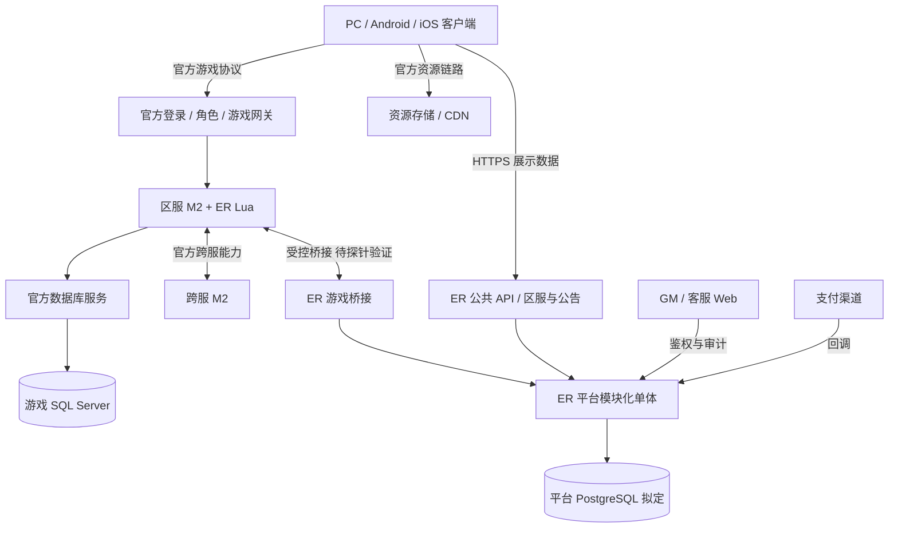

# 技术架构

## 分层与数据权威

| 层 | 职责 | 数据所有者 |
|---|---|---|
| 客户端 | 输入、显示、UI、缓存、资源下载 | 只持展示/缓存状态，不判定奖励和伤害 |
| 官方运行时 | 登录、区服世界、战斗、角色资产、社交、跨服基础 | M2 及官方持久化链路 |
| ER Lua 业务 | NPC/活动/养成规则、业务校验、官方 API 适配 | 游戏状态仍经 M2 操作 |
| ER 平台 | 账号映射、订单、CDK、发布、后台、审计、分析 | 独立平台数据库 |
| 内容与构建 | schema、表格、脚本、GUI、资源清单、制品 | 版本化源数据与不可变制品 |
| 运维 | 区服编排、监控、备份、恢复、容量与发布 | 环境配置及可审计操作记录 |

## 在线架构



图中网关登录阶段是职责抽象，不保证三个独立进程严格按箭头串联；实际组件与连接图由 M0 清点生成。跨服 DB/角色归属和游戏桥接传输方式仍需版本能力验证。

平台不可越过游戏桥接直接写游戏资产。客户端请求只能表达操作意图。平台订单数据库提交与 M2 写资产之间不存在天然分布式事务；见[平台服务](platform-services.md)的发货状态机。

## 代码模块（规划目录，当前尚未创建）

```text
server-lua/er/            领域规则、入口校验、runtime 适配、生命周期
client-lua/er/            UI 行为、状态缓存、消息路由、多端适配
gui-export/              官方工具导出的界面，独立于手写逻辑
data-tables/              源表、规范 CSV、schema、ID 注册表
protocol/                 自有消息注册与 payload schema
toolkit/                  校验器、构建封装、BOM、部署 CLI
platform/                 账号、订单、CDK、GM、发布、统计模块
resources/manifests/      来源、逻辑路径、哈希、分包策略；大资源独立存储
db-custom-migrations/     自有平台迁移，官方迁移仅登记及引用
deploy/                   环境模板、Windows 脚本、平台部署与监控配置
tests/                    单元、契约、官方集成、机器人、故障场景
docs/                     设计、决策、进度与证据索引
```

仓库起步为单仓库，避免未成熟契约在多仓之间漂移。独立发布节奏、权限隔离或制品体积明确需要时再拆分 `emberrealm-*`，拆分必须保持 release BOM 跨模块关联。

依赖方向：领域规则依赖 ER 契约；ER runtime 依赖官方 API；客户端依赖业务消息/schema；工具链生成双方配置。官方函数只集中在适配与入口文件，领域模块可用 fake runtime 离线验证。

## 内容与交付链路

```mermaid
flowchart LR
  Source[Git 源码 / 表格 / 资源清单] --> Validate[静态与契约校验]
  Validate --> Export[官方转换 / GUI / 编码构建]
  Export --> Artifacts[服务端包 / DEV 包 / 资源包]
  Artifacts --> BOM[不可变 BOM 与制品校验]
  BOM --> Test[隔离测试区 + 契约/场景测试]
  Test --> Staging[预发布与灰度]
  Staging --> Prod[正式区]
  Prod --> Observe[观测 / 审计 / 回滚判断]
```



自动化能力不足的官方工具标记为人工步骤并保存操作证据，不把“可在 GUI 中完成”描述成“CI 已自动化”。构建使用锁定官方工具，不从网络临时获取最新包。

## 同步、缓存和故障边界

- M2 在其受支持模型内拥有区服世界状态；ER 不自建旁路 AOI/战斗状态，也不在 Lua 回调线程中做长时间网络等待。
- HTTP/轮询/其他官方扩展桥接以能力探针选择。没有非阻塞能力时，限制功能范围或用受控外部桥接，不假定回调一定异步。
- 客户端缓存失效采用版本/服务器响应，重连重新拉取必要状态；不上报完整资产快照覆盖服务端。
- 平台暂时失效时，游戏基础链路原则上独立运行；暂停依赖平台的充值领取与活动写操作，公告等可用缓存。实际行为按场景实测。
- 游戏库失效时，优先进入维护/拒绝关键写操作，避免盲目继续运行；确认官方行为后编写明确 runbook。
- 资源发布先完成分发再切换入口，保留上一稳定版本；部分下载和过期缓存场景必须验证。

## 跨服所有权

一个角色在同一时刻只有一个有效写入归属。ER 定义进入申请、迁移中、跨服中、返回中、已归区、待核对的业务状态；由官方原生能力承载状态迁移。是否能提供 epoch/token、持久归属标记、查询与幂等要在 M6 前验证。缺少保证时关闭涉及高价值资产的自定义跨服玩法，不自行拼装未经验证的双写。

## 版本契约

一个 release 锁定官方引擎、客户端、数据库 schema、Lua API、工具、ER 脚本、表格、消息、资源、平台及自有迁移。能力矩阵回答“这个组合能做什么”；BOM 回答“这个运行实例用了什么”。两者都必须有版本与证据，不能只记业务版本号。
