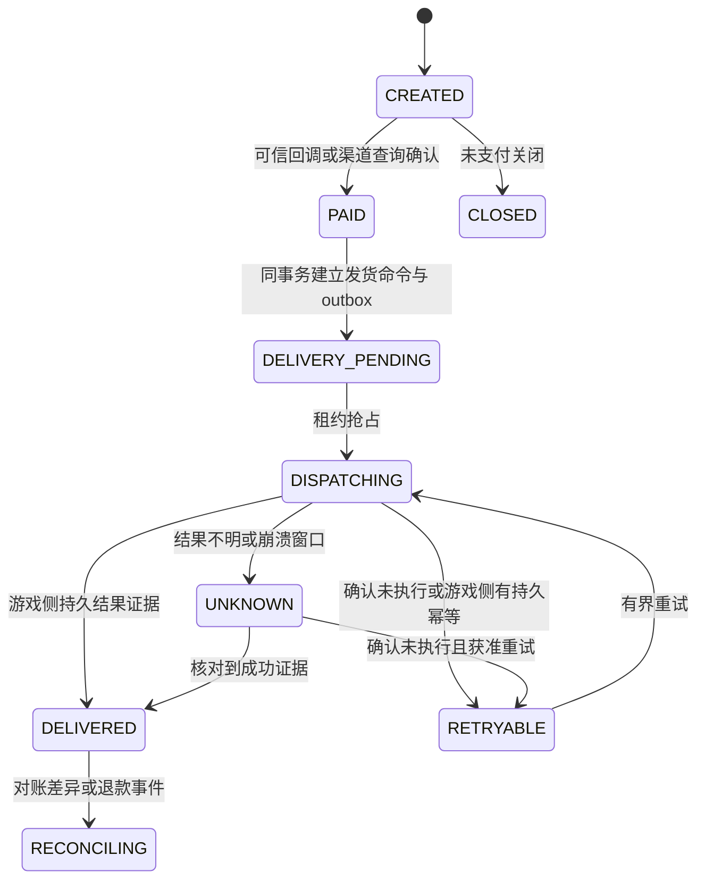

# 外围业务服务与资产一致性

## 平台形态

拟用一套 Go 模块化单体与独立 PostgreSQL 起步：账号映射、订单、奖励命令、CDK、配置/公告、GM/客服、发布和统计分模块管理。模块化后可按明确负载/安全边界拆服务；当前不先建设微服务集群。

只在确有跨区、账号、订单、统计或权限需求时使用外围平台，内置行会/邮件/排行等优先复用。Redis 可作缓存/限流，持久状态、租约和奖励结果保留在数据库，不能以缓存锁作为唯一一致性证明。

## 账号与渠道

平台验证渠道身份并创建稳定映射，使用官方受支持方式交给登录流程。账号 subject 不采用可变昵称/手机展示值作为主键。统一记录 account、官方账号/角色、区服与渠道映射，切服和跨服要重新验证目标归属。

短期凭据有效期、受众、重放和撤销在选定渠道与官方接入方式后确定；不假定 M2 接受平台自签 token。渠道 SDK、应用商店包和 iOS 签名账号在 M5 验证，不能在文档阶段宣称可发布。

## 支付与发货状态机

订单与奖励命令独立建模：

图中 PAID 是订单确认；DELIVERY_* 属奖励命令的投影状态，不要求订单与命令共用同一列。`UNKNOWN` 阻止自动重发。退款不自动反向扣资产，按渠道/商品/游戏规则建立审计处理流程。

发货步骤：验证回调 → 平台事务去重支付事件、更新订单、保存不可变商品快照和奖励命令/outbox → worker 获取租约 → 查询目标区服/玩家归属 → 游戏桥接执行 → 取得可查的持久执行证据 → 平台记录到账 → 定期渠道/平台/游戏三方对账。

worker 至少一次投递，命令 ID 稳定；租约过期和网络超时只说明未拿到回应，不能证明游戏没有发奖。

## 游戏侧三类能力

| 能力 | 可接受策略 | 允许的业务范围 |
|---|---|---|
| 官方能把业务键与资产写入原子持久化，并可查询 | 同一 command 重发返回已有结果；平台安全重试 | 通过故障测试后可开放真实支付 |
| 有官方内置订单/充值链路且提供受支持幂等凭据 | 复用其发货与查询，ER 管订单映射与审计 | 以官方契约及实测为准 |
| 只有“加道具/改变量”等非原子调用 | 记录未知窗口，停止自动重试，人工核对或暂停功能 | 仅受控沙箱；真实付费发布门槛未通过 |

禁止将“内存去重”“先写已发变量再给道具”“先给道具再标记已发”“平台 DB 唯一键”当成跨 M2 的 exactly-once 保证。前两种会丢奖励，后一种会重复，平台唯一约束无法消除游戏写入与确认之间的崩溃窗口。

测试必须在命令前、资产写入前后、标记保存前后、回包前后注入中断，重启并核对结果。若无法获得官方原子语义，应缩小功能或选择官方内置发货，不能靠补充日志绕过门槛。

## 离线、跨服和部分发货

在线对象离线时不要把旧对象继续写入；可用官方可靠邮件/离线充值接口时仍验证其幂等和持久结果。没有可靠路径则排队等待上线。跨服中遵守唯一写归属，不能原区/跨服各发一次。奖励包必须整包原子或有逐项唯一键及结果，禁止不记录结果的批量重发。

## 其他模块

| 模块 | 最小能力 | 关键约束 |
|---|---|---|
| CDK | 活动、期限、目标条件、兑换记录 | 码摘要存储、猜码限流；领取与发货关系复用奖励状态机 |
| 公告/活动配置 | 版本、有效期、区服范围、发布记录 | 客户端只展示；变更影响当前活动需明确版本规则 |
| 客服查询 | 玩家/订单只读查询、脱敏结果 | 权限过滤；只读服务不持有资产写权限 |
| GM | 封禁/补偿/维护命令、状态、原因、审计 | 固定操作集合、重试语义、目标确认；不提供任意 SQL/Lua 执行 |
| 分析 | 登录、留存、行为与支付事件 | 去重与迟到处理；不依赖分析库发资产 |
| 版本/区服管理 | BOM、区服入口、环境、发布/回滚状态 | 每个部署绑定不可变制品，不手动覆盖 |

## HTTP 接口草案

`POST /v1/orders`、`POST /v1/payment-callbacks/{channel}`、`GET /v1/orders/{id}`、`POST /v1/cdk/claims`、`POST /v1/admin/commands`、`GET /v1/releases/{id}` 只作为模块契约建议。鉴权来源、错误、限流、幂等与审计写入 API schema；真实端点尚未实现。

订单创建由可信服务端确定商品/币种/金额，客户端只能选择受允许的商品。后台和公共入口网络与权限分离，审计与消息均有 trace/request/command ID 关联。

## 最小上线门槛

支付沙箱重复/乱序/延迟回调通过；故障注入验证不重复、不丢失或明确 UNKNOWN；渠道对账能定位差异；GM 越权被拒并可审计；平台停机不影响已验证的基础游戏链路。未确认游戏发货原子性时，真实支付任务不能标记完成。
